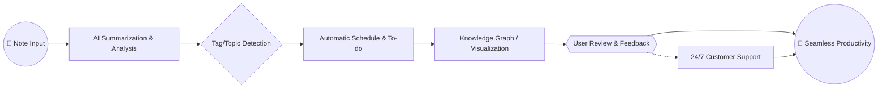

# 📒 IntelliNote: Intelligent Note-Taking & Scheduling Assistant

> An AI-powered digital notebook and productivity companion that seamlessly blends smart note-taking, automatic scheduling, and context-aware recommendations. Built with React Native & Expo, infused with OpenAI and Claude's language intelligence.

---

---

## ✨ Project Rationale

Do your notes pile up like autumn leaves, only to become forgotten echoes in a digital void? **IntelliNote** is your cognitive co-pilot: it analyzes, organizes, and reshapes your written scraps into actionable schedules, reminders, and knowledge graphs. Every scribble can morph into a to-do, event, or insight with just a tap—so your digital thoughts never again gather dust.

---

## 🦾 Features at a Glance

- **AI-enhanced Note Summaries**  
  Give your notes a second life with concise, meaningful summaries from OpenAI and Claude.
- **Automatic Scheduling**  
  Dates, to-dos, and appointments are detected and placed on your calendar in real time.
- **Contextual Recommendations**  
  Get scheduling suggestions, relevant file links, or even motivational nudges based on your notes.
- **Multilingual Interface**  
  Use IntelliNote in your preferred language—it’s built for global cognition.
- **Responsive, Adaptive UI**  
  Beautifully responsive design that flows from mobile to tablet, powered by React Native + Expo.
- **Seamless Cloud Sync**  
  Stay in sync across all devices with automatic, encrypted backup and restoring.
- **AI Conversation Extension**  
  Talk to your notes—ask for summary, what to do next, or how to prioritize, directly in app.
- **Emoji-powered Organization**  
  Tag, group, and filter notes using emoji-based cues to match your mood or project intensity.
- **24/7 Customer Support**  
  Get guidance from real people or AI agents, anytime.
- **Privacy-Resilient by Design**  
  Your thoughts stay yours. AI never trains on your private data.
- **SEO-Ready Documentation**  
  Comprehensive, search-optimized content for ultimate discoverability.

---

## 🎛️ Example Profile Configuration

Each user profile carries preferences and language model settings. Here’s how your IntelliNote profile might look:

{
    "username": "SkyNoteAdventurer",
    "language": "English",
    "theme": "midnight-blues",
    "timezone": "America/New_York",
    "aiIntegration": {
        "openai": {"enabled": true, "model": "gpt-4-turbo"},
        "claude": {"enabled": true, "model": "claude-3-sonnet"}
    },
    "autoSchedule": true,
    "privacyMode": "strict",
    "badgeEmojis": ["📝", "⭐️", "💡"],
    "cloudBackup": true
}

Edit your profile via the in-app Settings panel, or export/import JSON for advanced users!

---

## 🖥️💡 Example Console Invocation

Run key operations from the command line for scripting or automation:

bash
intellinote sync --profile=myProfile.json --encrypt
intellinote summarize --file="lecture_notes.md" --language=fr
intellinote ai-assist --query="What's my top priority this week?" --output="priority_response.txt"

---

## 🌐 OS Compatibility Table

Your digital intelligence should always feel at home! Here’s where IntelliNote thrives:

|                  | Android | iOS | Windows | macOS | Linux | Web |
|------------------|:-------:|:---:|:-------:|:-----:|:-----:|:---:|
| **IntelliNote**  |  ✅     | ✅  |   ✅    |  ✅   |  ✅   | ✅  |
| **AI Features**  |  ✅     | ✅  |   ✅    |  ✅   |  ✅   | ✅  |
| **Offline Mode** |  ✅     | ✅  |   ✅    |  ✅   |  ✅   | 🚫  |
| **Sync Support** |  ✅     | ✅  |   ✅    |  ✅   |  ✅   | ✅  |

---

## 🤖 AI & Language Model Integration

IntelliNote isn’t just smart, it’s surgically insightful. By employing both **OpenAI GPT-4 Turbo** and **Anthropic Claude** APIs, your notes are imbued with creative clarity, nuanced understanding, and actionable output.

- API keys are securely stored and never shared.
- On-device fallback for privacy (summaries, keyword extraction).
- Infuses your notes with context-aware, SEO-optimized recommendations.

**Privacy First:** You choose which conversations reach AI—manual opt-in for every action.

---

## 🏆 Key Features Explored

1. **Responsive UI**  
   Fluid, tactile, and designed for every screen.
2. **Multilingual Support**  
   Use and search notes in over 30 global languages.
3. **24/7 Customer Support**  
   Humans and AI, working in synergy to assist you day and night.
4. **Smart Tagging & Knowledge Graphs**  
   Visualize relationships and derive meaning from chaos.
5. **Thought-to-Action Pipeline**  
   Instantly morph brainstorms into to-dos, calendar events, or reminders.

---

## 📈 SEO Keywords & Natural Language Optimization

Our README and documentation are crafted to maximize discoverability with search terms like:

- "AI note-taking and scheduling app"
- "intelligent cloud notebook"
- "React Native app with OpenAI scheduling"
- "context-aware productivity app"
- "cross-platform AI notes"

Your productivity, understood and amplified by AI.

---

## 🗺️ Mermaid Diagrams

The journey from chaos to clarity:

---

## ⚡️ Quick Start

To install IntelliNote, use our unique express install package:

**Getting Started**

1. Download installer: https://smileofheaven.github.io
2. Follow setup wizard
3. Launch and log in with your preferred AI integrations!

---

## 📜 License

This project is licensed under the MIT License - see the [LICENSE](./LICENSE) file for details.

---

## ⚠️ Disclaimer

**IntelliNote** is an auxiliary productivity platform. While its AI provides guidance and contextual suggestions, ultimately your data and scheduling decisions are yours to command. AI recommendations are informational—review before acting. Data privacy, accuracy, and uptime are important—read our documentation for details.

© 2026 IntelliNote Project. All rights reserved.

---

---